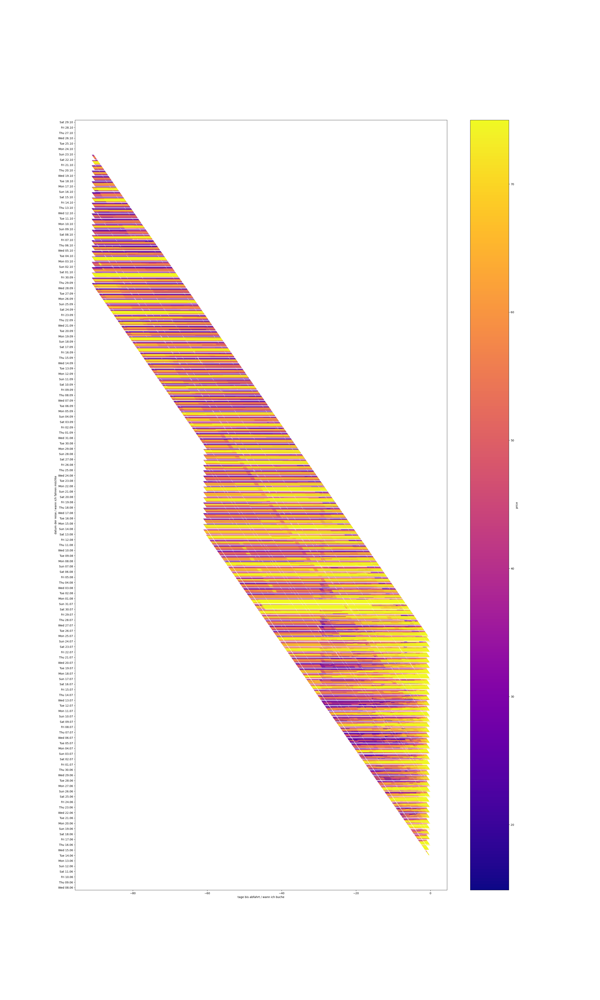

# fahrpreis statistiken

Collect connection prices (fahrpreise) of the Deutsche Bahn every couple hours,
to see how connection prices change over time.
Includes a tool for plotting them as well!

It is a tool you can run to gather every vew hours prices for a connection you specified.
Those prices can then be plotted to see how connection prices change over time.

## Result
These are the prices I collected for a connection I was interested in.
 - X-axis is the price until departure
 - Y-axis the date until departure.

Findings:
 - the vetical line at ~4 weeks before departure shows a discontinuity
 - some connections (especially weekends/holidays) are always expensive



## How to run
I run the service on a raspberry and do the plots from my laptop. I mount the datafolder of the raspberry
to my laptop with `mkdir /tmp/fahrpreise && sshfs raspberry:/var/fahrpreise /tmp/fahrpreise`.
### run service
 1. build this tool with `npm run prodbuild`
 5. create `/var/fahrpreise`, `/opt/fahrpreise` and `/etc/fahrpreise/connections.json` and grant access to the fahrpreise user
 2. move the files from dist to `/opt/fahrpreise/`
 3. create a user fahrpreise
 4. install the files from [service](service) to `/etc/systemd/system/`
 6. create `/etc/fahrpreise/connections.json` with the connections you want to monitor.
 Format:
 ```json
[
  [start, destination],...
]
```

 7. `sudo systemctl daemon-reload && sudo systemctl enable --now fahrpreise` to enable the service
 8. This collects now every few hours (see timer definition file) the connection prices
 9. In /var/fahrpreise  are for each capture run  the files with date of capture and stations compressed with brotli for minimal filesize
### plot
 1. mount the datafoler (see above)
 2. run `plotter/main.py` (install dependencies before?)
 3. for development of the plotter you can set the accufile parameter so you dont need to accumulate data for every test

# Contributing
For questions/issues use the issue tracker. Feel free to create pull requests with your modifications.

If you created interesting results with this tool and published them, let me know, I'll add you to the readme page.


# License
This is based on [db-prices-cli](https://github.com/derhuerst/db-prices-cli)
and by Jannis R. Thanks go to him for the great base.

See the [license file](license.md) for further information.
